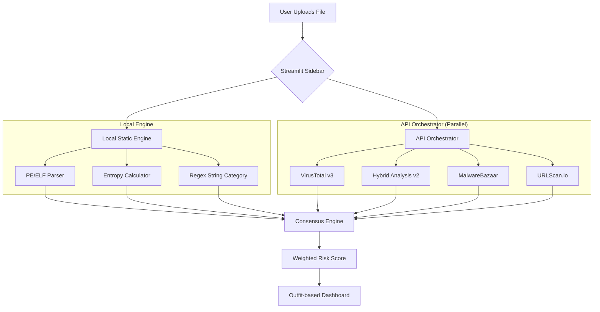

<div align="center">

```
███╗   ███╗ █████╗ ██╗     ███████╗ ██████╗ █████╗ ███╗   ██╗
████╗ ████║██╔══██╗██║     ██╔════╝██╔════╝██╔══██╗████╗  ██║
██╔████╔██║███████║██║     ███████╗██║     ███████║██╔██╗ ██║
██║╚██╔╝██║██╔══██║██║     ╚════██║██║     ██╔══██║██║╚██╗██║
██║ ╚═╝ ██║██║  ██║███████╗███████║╚██████╗██║  ██║██║ ╚████║
╚═╝     ╚═╝╚═╝  ╚═╝╚══════╝╚══════╝ ╚═════╝╚═╝  ╚═╝╚═╝  ╚═══╝
```                                   
# MalScan AI-Assisted Malware Behavior Analyzer

MalScan is a high-performance, professional-grade triage dashboard designed for rapid malware analysis. It bridges the gap between deep local static analysis and multi-engine cloud intelligence, providing a unified, high-confidence risk assessment in seconds.

---

## 📑 Table of Contents
1. [Overview](#-overview)
2. [Features](#-features)
3. [Architecture](#-architecture)
4. [Tech Stack](#-tech-stack)
5. [Algorithm](#-algorithm)
6. [Project Structure](#-project-structure)
7. [API Reference](#-api-reference)
8. [Getting Started](#-getting-started)
9. [Setup](#-setup)
10. [Environment Variables](#-environment-variables)
11. [Testing](#-testing)
12. [UI Design](#-ui-design)

---

## 🔍 Overview
MalScan is designed for security researchers and incident responders who need to quickly determine the nature of a suspicious file. Instead of relying on a single detection method, MalScan orchestrates a battery of local static checks and parallelized cloud sandboxing results to generate a **Weighted Risk Score (60/40)**. It supports Windows PE and Linux ELF formats out of the box.

---

## ✨ Features
- **Concurrent API Orchestration**: Leverages `ThreadPoolExecutor` to query 4 major threat feeds simultaneously.
- **Deep Static Analysis**: Local parsing of IAT, Export Tables, Entry Points, and Sections.
- **Shannon Entropy Heatmaps**: Visualizes file packing and obfuscation patterns.
- **AI-Categorized Strings**: Segregates raw binary strings into Network, Path, Command, and Malicious categories.
- **Consensus Builder**: Cross-references VT verdicts, Hybrid Analysis reports, and MalwareBazaar signatures.
- **Safe Execution**: All processing is off-host or purely static; no malware execution occurs on the local machine.

---

## 🏗 Architecture
MalScan follows a decoupled architecture where the UI never blocks on network/heavy computation tasks.



---

## 🛠 Tech Stack
- **Dashboard**: [Streamlit](https://streamlit.io/) (Frontend and Data Layer)
- **Visuals**: [Plotly](https://plotly.com/) (Entropy Heatmaps & Risk Gauges)
- **Parsing**: `pefile` (Windows), `pyelftools` (Linux)
- **Core**: Python 3.10+, `Pandas`, `concurrent.futures`
- **APIs**: Hybrid Analysis v2, VirusTotal v3, MalwareBazaar, URLScan.io

---

## 🧮 Algorithm
MalScan calculates a **Final Risk Score (0-100)** using a weighted distribution:

### 1. Static Analysis Score (40%)
| Component | Metric | Score Impact |
|-----------|--------|--------------|
| Entropy | Global Entropy > 7.5 | +15 pts |
| Sections | High Entropy Sections (>7.0) | +20 per (Max 60) |
| Imports | Suspicious Win32/API calls | +10 per (Max 50) |
| Strings | Network/Malicious Indicators | +5/8 per (Max 40) |

### 2. API Intelligence Score (60%)
- **VirusTotal**: +50 pts if 5+ engines detect.
- **Hybrid Analysis**: +50 pts for 'malicious' verdict, +25 for 'suspicious'.
- **MalwareBazaar**: +40 pts for a definite family signature match.

`Risk Score = Min(100, (Static_Score * 0.4) + (API_Score * 0.6))`

---

## 📁 Project Structure
```text
streamlit-dashboard-v2/
├── app.py               # Main UI and Dashboard logic
├── analysis_engine.py    # Local Static Analysis (PE/ELF/Strings)
├── api_clients.py        # Concurrent API Orchestration & Life-cycle
├── config.py             # Global constants and Theme configuration
└── requirements.txt      # Dependency manifest
```

---

## 🔌 API Reference
The orchestrator maintains the following integrations:
- **Hybrid Analysis**: Full lifecycle support (Upload -> Poll -> Report).
- **VirusTotal**: Real-time hash reputation and vendor breakdown.
- **MalwareBazaar**: Instant family identification via SHA-256 lookup.
- **URLScan.io**: Reputation scoring for extracted network indicators.

---

## 🚀 Getting Started
### Setup
1. **Clone & Enter**:
   ```bash
   git clone https://github.com/aayushi484/MalScan
   cd streamlit-dashboard-v2
   ```
2. **Environment**:
   ```bash
   python -m venv venv
   source venv/bin/activate  # Or `venv\Scripts\activate` on Windows
   pip install -r requirements.txt
   ```

### Environment Variables
Configure your keys in `config.py`:
```python
HYBRID_ANALYSIS_API_KEY = "..."
VIRUSTOTAL_API_KEY      = "..."
URLSCAN_API_KEY         = "..."
```

---

## 🧪 Testing
Run the dashboard locally to verify environment health:
```bash
streamlit run app.py --server.port 8504
```
**Static Test**: Upload a known non-malicious binary (like `calc.exe`) to verify the parsing engine correctly identifies the format and entry points.

---

## 🎨 UI Design
MalScan utilizes a **Flat Dark Utility** design philosophy:
- **Font**: [Outfit](https://fonts.google.com/specimen/Outfit?query=outfit) — chosen for its modern, geometric clarity.
- **Colors**: High-contrast Slate (`#0B0E14`) and Cyan (`#00A3FF`) accents for a premium, technical feel.
- **Philosophy**: Remove all "neumorphic" or floating effects to prioritize data density and professional utility.

---
*Created by the MalScan Team.* 🛡️
